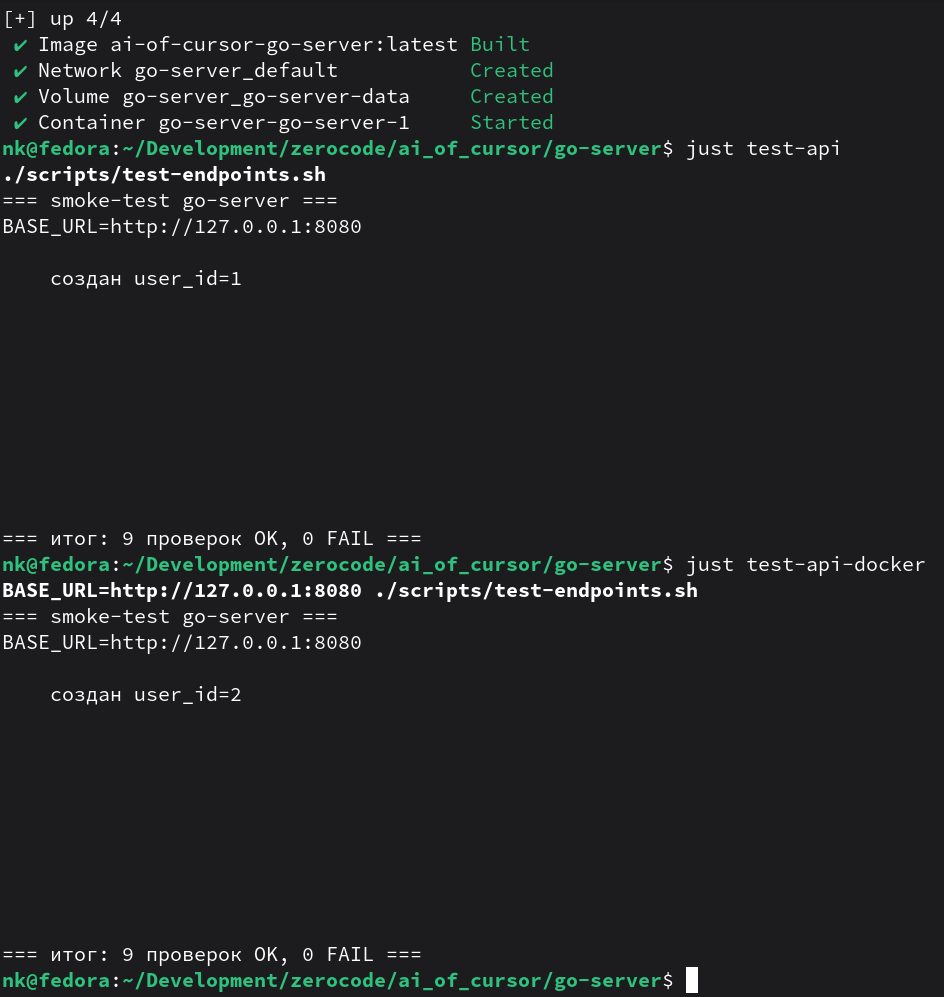

# Go Server

Этот каталог содержит порт `api.py` на Go с эквивалентными маршрутами и поведением.

## Что реализовано

- SQLite база `test.db` и автоинициализация таблицы `users`.
- Эндпоинты:
  - `POST /adduser`
  - `GET /user/{uid}`
  - `GET|POST /activate/{uid}`
  - `GET /slow`
  - `GET /wrong`
- Потокобезопасный список активных пользователей (лимит 100).
- Сервер слушает `0.0.0.0:8080`.

## Требования

- Go 1.22+

## Структура проекта

```
go-server/
├── cmd/server/main.go       # точка входа
├── internal/
│   ├── config/              # константы (порт, путь к БД)
│   ├── models/              # DTO и модели ответов
│   ├── database/            # подключение и схема SQLite
│   ├── repository/          # работа с таблицей users
│   ├── service/             # бизнес-логика (активные пользователи, фоновые задачи)
│   ├── handler/             # HTTP-обработчики
│   ├── router/              # регистрация маршрутов
│   └── util/                # JSON-ответы, разбор пути
├── go.mod
├── openapi.yaml             # OpenAPI 3.1
└── README.md
```

## OpenAPI 3.1

Спецификация API: [openapi.yaml](openapi.yaml).

Просмотр (при установленном [Swagger Editor](https://editor.swagger.io/) или Docker):

```bash
# Swagger UI (Docker)
docker run --rm -p 8081:8080 \
  -e SWAGGER_JSON=/openapi.yaml \
  -v "$(pwd)/openapi.yaml:/openapi.yaml" \
  swaggerapi/swagger-ui
# Открыть http://127.0.0.1:8081
```

Валидация (опционально, [Redocly CLI](https://redocly.com/docs/cli/)):

```bash
npx @redocly/cli lint openapi.yaml
```

## Команды (just)

| Команда | Описание |
|---------|----------|
| `just` | список рецептов |
| `just run` | запуск сервера |
| `just build` | сборка бинарника `server` |
| `just tidy` | `go mod tidy` |
| `just fmt` | `gofmt` для `cmd` и `internal` |
| `just vet` | `go vet ./...` |
| `just test` | `go test ./...` |
| `just docker-build` | сборка Docker-образа |
| `just docker-up` | `docker compose up -d --build` |
| `just docker-down` | остановка compose |
| `just docker-logs` | логи контейнера |
| `just test-api` | проверка всех эндпоинтов (`scripts/test-endpoints.sh`) |

## Установка и запуск

```bash
cd go-server
go mod tidy
just run
```

Сервер поднимется на `http://127.0.0.1:8080`.

## Сборка

```bash
cd go-server
go build -o server ./cmd/server
./server
```

## Docker

Локально или на сервере (нужны Docker и Docker Compose):

```bash
cd go-server
docker compose up -d --build
```

Сервер: `http://127.0.0.1:8080`. База SQLite (`test.db`) хранится в volume `go-server-data`.

Только образ без compose:

```bash
docker build -t ai-of-cursor-go-server:latest .
docker run --rm -p 8080:8080 -v go-server-data:/app ai-of-cursor-go-server:latest
```

Остановка:

```bash
docker compose down
```

## Проверка эндпоинтов

Скрипт `scripts/test-endpoints.sh` последовательно вызывает все маршруты и проверяет HTTP-коды и ключевые поля в JSON.

Сервер уже запущен (`just run` или Docker):

```bash
./scripts/test-endpoints.sh
# или
just test-api
```

Удалённый хост:

```bash
BASE_URL=http://your-server:8080 ./scripts/test-endpoints.sh
```

После `docker compose up`:

```bash
just test-api-docker
```



## API: примеры

### 1) Создать пользователя

```bash
curl -s -X POST http://127.0.0.1:8080/adduser \
  -H "Content-Type: application/json" \
  -d '{"name":"Alice"}'
```

Ответ:

```json
{"status":"ok","id":1,"name":"Alice"}
```

### 2) Получить пользователя

```bash
curl -s http://127.0.0.1:8080/user/1
```

Ответ `200`:

```json
{"id":1,"name":"Alice"}
```

Если не найден:

```json
{"error":"not_found"}
```

### 3) Активировать пользователя

```bash
curl -s -X POST http://127.0.0.1:8080/activate/1
```

Ответ:

```json
{"status":"ok","active":[1]}
```

### 4) Фоновая задача

```bash
curl -s http://127.0.0.1:8080/slow
```

Ответ `202`:

```json
{"status":"scheduled"}
```

### 5) Демонстрация ошибки

```bash
curl -s http://127.0.0.1:8080/wrong
```

Ответ `500`:

```json
{"msg":"error","detail":"division by zero"}
```

## Примечания

- База `test.db` создается в каталоге `go-server`.
- Для удаления локальных данных можно удалить файл `test.db`.
